# manda-zap

## About the project

Created this project to practice my studies about Javascript DOM.

On this project **manda-zap** you can create standard messages that can be sent on WhatsApp and if you wanna destroy some message who are stored, it's possible too.

## How to see the project?

You can see the project through the following link: https://wendelcutrim.github.io/manda-zap/

## Tech Stack

**Front-end:** `HTML`, `CSS`, `Javascript` and `Font Awesome`.

## Screenshots

### Home screen with no messages stored.

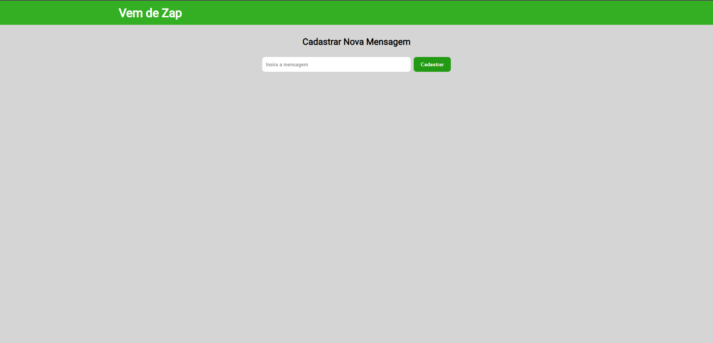

To create a new message, can you write the message on the input and click on the button "cadastrar" to store in the home screen.

``You can create has many messages as you like.``

### Home screen with messages stored

### Send some message

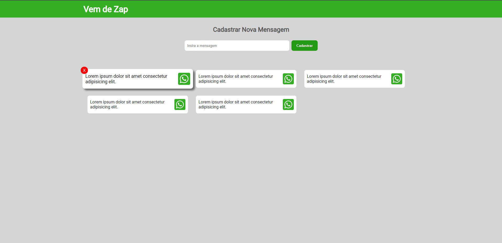

To send a message who are stored, needed to click on the message and will appear a prompt dialog on the screen, on this prompt it's necessary insert the telephone number.

``*This project only works with Brazil (BRA) numbers. It isn't necessary to enter the DDI +55, only the area code and telephone number with the ninth digit.`` 

Example of a phone number who the input will accepts:

``DDD + phone number with the ninth digit: 1191245678`` 

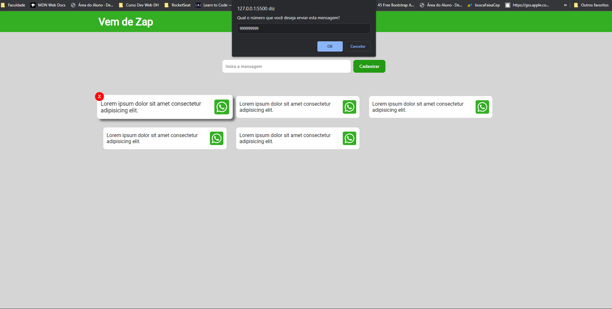

If the number inserted on the prompt have 9 digits, the project will call the WhatsApp API send the parameters: **Telephone number and the Message**

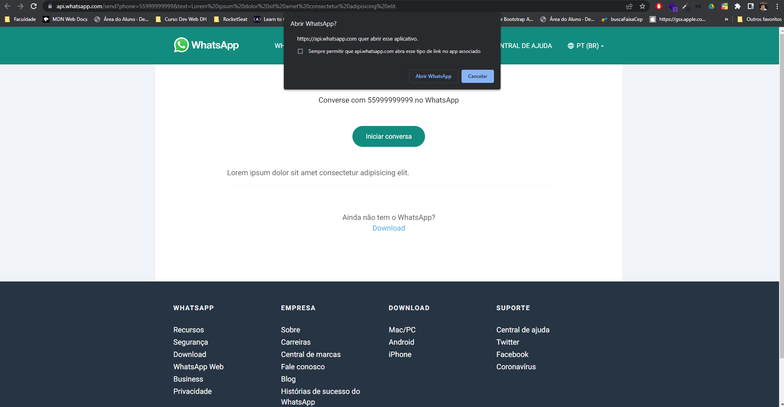

### Delete some stored message

To delete a stored message can you put the mouse over the card message who wanna delete. Note if the card are in focus, they height will be grow up and will appear the red button with "X" to delete.

When the card is in focus and the red button is on focus too, the red button will grow up and will appear a black border on the button. When this black border appear, you can click on the button to delete the card message.

On this example the 6th card (message: "Will be deleted") are in focus and the red button too.

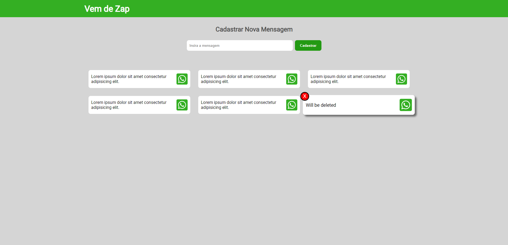

When the button click event occurs, the card message will be deleted.

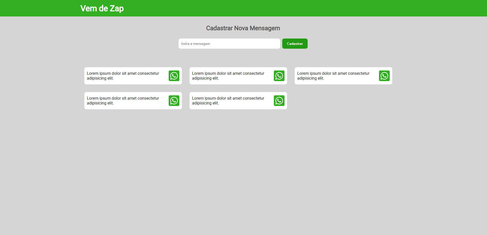

## Responsive

The project have 3 breakpoints and are responsive for all devices like: Smartphones, Tables, Notebooks, Desktops. 

The cotainer will be locked in 1280px;

### Devices examples

**iPhone 6/7/8 (375px X 667px)**

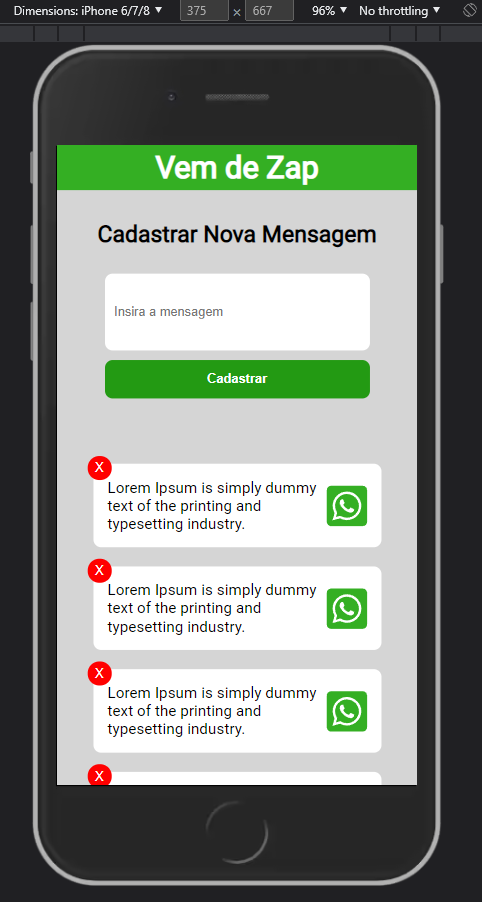

**iPhone 6/7/8 Plus (414px X 736px)**

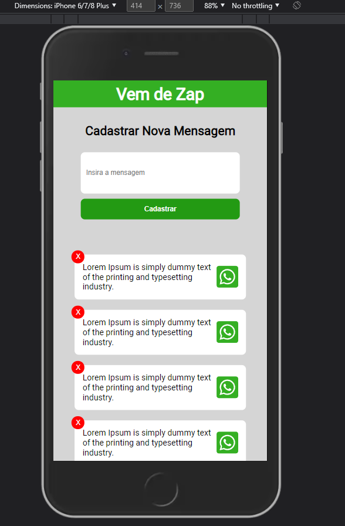

**iPhone X (375px X 812px)**

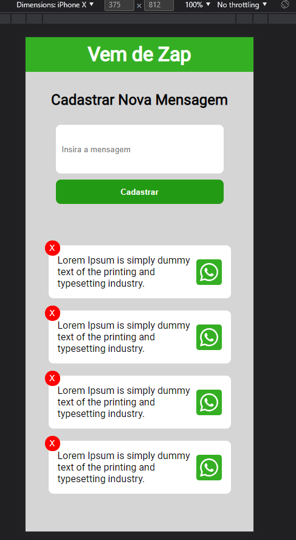

**iPhone XR (414px X 896px)**

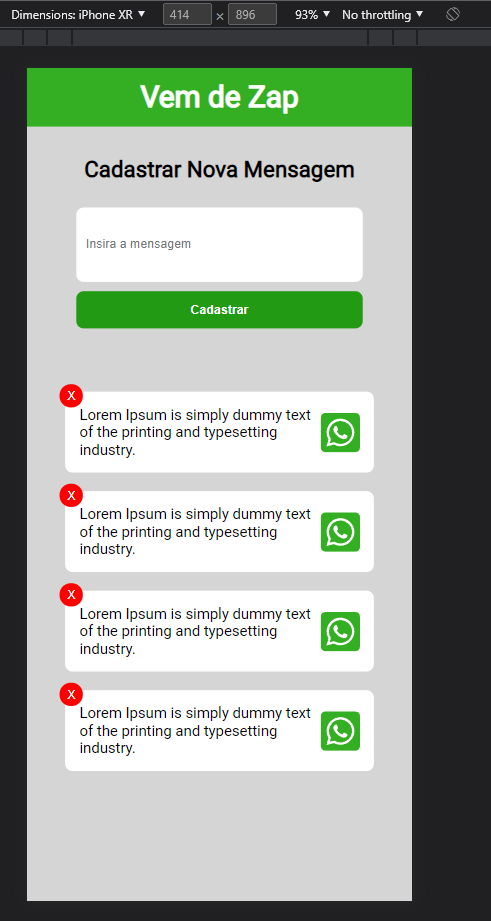

**iPad Mini (768px X 1024px)**

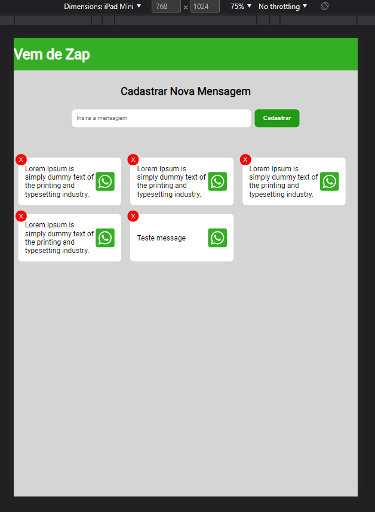

## Athor

- [@wendelcutrim](https://www.github.com/wendelcutrim)